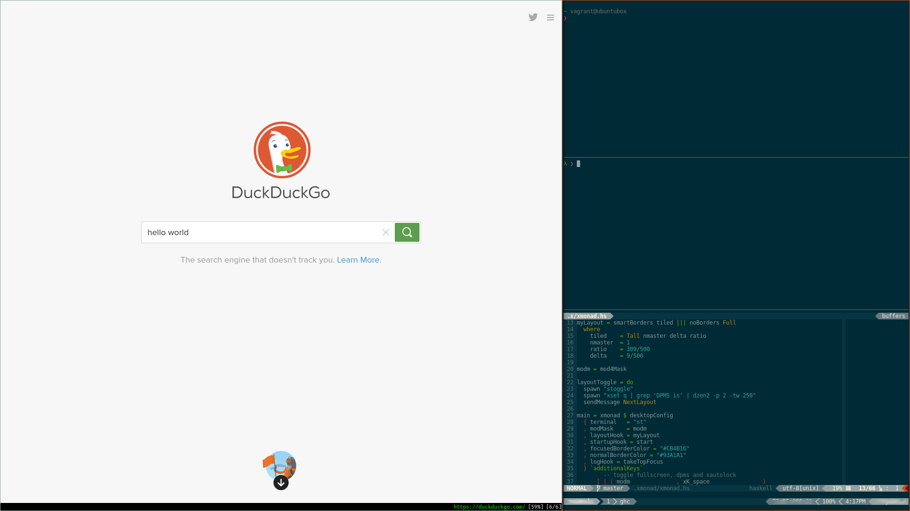

### About
My preferred configuration for `Zsh`, `Tmux`, `Neovim`, `GHCi` and `Xmonad`.
******

#
### Usage

> &nbsp; **dotinstl [-aztnxi]**  
> &nbsp; **dotinstl [-aztnxu]**
> > **-a** &nbsp; &nbsp; *Install all dotfiles*  
**-i** &nbsp; &nbsp; *Install package dependencies for chosen dotfiles*  
**-u** &nbsp; &nbsp; *Uninstall chosen dotfiles*  
**-z** &nbsp; &nbsp; *Install Zsh dotfiles*  
**-t** &nbsp; &nbsp; *Install Tmux dotfiles*  
**-g** &nbsp; &nbsp; *Install GHCi dotfiles*  
**-n** &nbsp; &nbsp; *Install Neovim dotfiles*  
**-x** &nbsp; &nbsp; *Install X11 dotfiles*  
**-h** &nbsp; &nbsp; *Print this usage message*  
